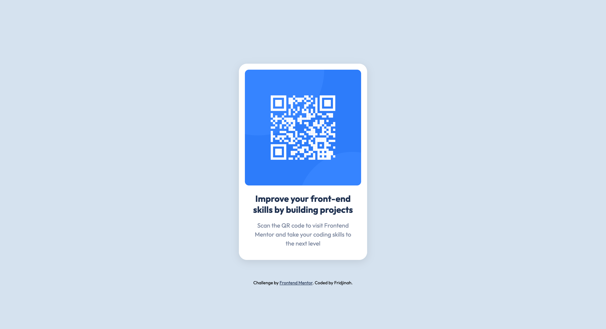

# Frontend Mentor - QR code component solution

This is a solution to the [QR code component challenge on Frontend Mentor](https://www.frontendmentor.io/challenges/qr-code-component-iux_sIO_H). Frontend Mentor challenges help you improve your coding skills by building realistic projects. 

## Table of contents

- [Overview](#overview)
  - [Screenshot](#screenshot)
  - [Links](#links)
- [My process](#my-process)
  - [Built with](#built-with)
  - [What I learned](#what-i-learned)
  - [Useful Resources](#useful-resources)
- [Author](#author)


## Overview

### Screenshot



### Links

- Solution URL: https://github.com/JinahC/qr-code-component-main
- Live Site URL: https://fm-challenge-qr-code.netlify.app/

## My process

### Built with

- Semantic HTML5 markup
- SASS
- Flexbox
- Mobile-first workflow
- Google Fonts


### What I learned

I learned how to compile SCSS files from the command line. In college, I was taught to use a GUI SASS complier called Koala (which I just found out production on the application has stopped).

I looked at [SASS Basics](https://sass-lang.com/guide/#preprocessing) and saw that you can use SASS from the command line. I never knew that. And now it's something that I will never forget as I continue building these projects.

This line of code allowed me to compile files in the `scss` folder into CSS files in the `css` folder. The `--watch` flag makes it so that the files are complied each time they are saved. Very handy.
```bash
sass --watch scss:css
```

### Useful resources

- [W3Schools](https://www.w3schools.com/sass/sass_import.php) - This helped me remember how to include partials in my SASS files. 
- [SASS](https://sass-lang.com/guide) - This was useful for learning how to install SASS and compile SASS via the command line.

## Author

- Frontend Mentor - [@JinahC](https://www.frontendmentor.io/profile/JinahC)
- Instagram - [@jazzyjinah](https://www.instagram.com/jazzyjinah)
